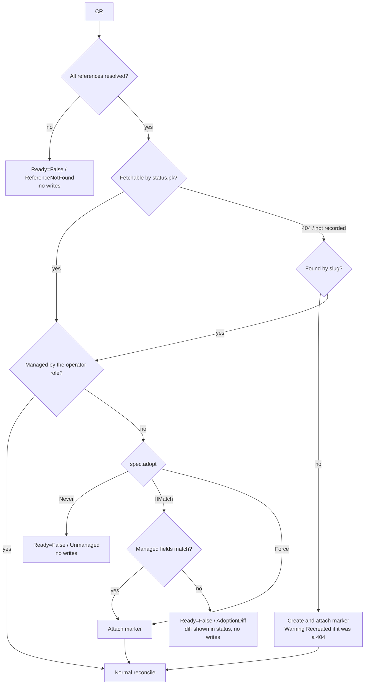

# authentik-operator Specification

- Status: Ready
- Document version: v1
- Target version: authentik 2026.8.x (verified against the 2026.8.2 source and a running 2026.8.2, §8)
- Last updated: 2026-09-15

## 1. Purpose and scope

authentik-operator manages authentik Applications, Providers, and access rights (PolicyBindings) declaratively through Kubernetes CRDs.
It adopts objects that were created in the UI safely and coexists with objects that remain under manual management.
The implementation uses Kubebuilder v4 and controller-runtime and is distributed as a Helm chart.

The operator aims to satisfy three goals.

1. **Protection of manual resources**: Applications, Providers, and PolicyBindings created in the UI are never modified or deleted without explicit permission.
2. **Conflict prevention between CRs**: two CRs never fight over the same Application.
3. **Drift repair**: when a managed object is changed in the UI, it is reverted to the values in the spec.

**Out of scope**

The following features are intentionally excluded because their use cases are limited.
When they become necessary, they will be considered as separate CRDs or fields.

- Providers other than Proxy Provider and OAuth2/OpenID Provider (LDAP, SAML, SCIM, RADIUS, RAC, Google Workspace, Microsoft Entra, SSF, and others)
- Additional Scopes (`property_mappings`) of the Proxy Provider
- Machine-to-Machine authentication settings of the Proxy Provider and the OAuth2 Provider (Federated OIDC Sources `jwt_federation_sources`, Federated OAuth2/OpenID Providers `jwt_federation_providers`)
- Backchannel Providers of the Application
- Selecting one of several ScopeMappings that share a `scope_name` by its `name` (§2.2)
- Creating Groups, Users, and Policies (existing ones are only referenced)
- Managing the forward auth configuration on the reverse proxy side (Ingress, Middleware, and others)

**Trust model**

The CRD is namespaced, but a CR in any namespace can use any Group, User, or Policy in authentik for its access rights.
The operator does not isolate tenants between namespaces and assumes that CR authors within the cluster are trusted.
Reference fields use an object form so that references to CRs (such as `groupRef`) can be added later if Groups and similar objects become CRDs (§2.2).

**Configurations with limited support**

Several operator instances can share one authentik only when each instance uses a different ownership role (§3.1).
Objects managed by another operator appear as unmanaged objects to this operator.
A configuration in which two operators manage the same Application is not protected, so operators are responsible for partitioning slugs.

## 2. CRD

### 2.1 Granularity and naming

The relationship between an Application and a Provider is 1:1.
`Application.provider` is a `OneToOneField`, so attaching one Provider to several Applications is prohibited by a database constraint (`authentik/core/models.py`).
Therefore, the operator provides a single composite CRD in which the Application holds the Provider and the access rights inline.
Access rights are written in each application's CR; there is no CRD that aggregates them per group.

| Item | Value |
|---|---|
| API group | `authentik.starry.blue/v1alpha1` |
| Kind | `AuthentikApplication` |
| shortName | `akapp` |
| Scope | Namespaced |

The Kind is not named `Application` because it would collide with Kinds of the same name, such as Argo CD's, in `kubectl get application`.

### 2.2 spec

Field names follow the labels shown in the authentik web UI.
Fields that do not appear in the UI use the API field name converted to camelCase.
Enum values are written in UpperCamelCase following Kubernetes conventions (for example `Any`, `Strict`, `HashedUserID`).

```yaml
apiVersion: authentik.starry.blue/v1alpha1
kind: AuthentikApplication
metadata:
  name: wiki
spec:
  slug: wiki                     # Required. Immutable after creation (CEL: self == oldSelf)
  name: Wiki                     # Required
  launchURL: ...                 # Everything below is optional
  icon: https://... | fa://...   # See the notes in §2.2
  description: ...
  publisher: ...
  group: ...                     # Display group in the library view. Not an authentik Group
  openInNewTab: false
  hideFromApplicationDashboard: false   # meta_hide
  deletionPolicy: Retain         # Retain | Delete. §3.8
  adopt: Never                   # Never | IfMatch | Force. §3.4
  provider:                      # Optional. When omitted, the Application has no Provider
    name: ...                    # Provider name. Defaults to the slug (§2.3)
    flows:                       # Shared by every Provider type. Reference syntax is described in the notes of §2.2
      authorization:             # Required
        slug: default-provider-authorization-implicit-consent
      invalidation:              # Required
        slug: default-provider-invalidation-flow
      authentication: { slug: ... }   # Optional
    proxy:                       # Exactly one of proxy and oauth2 (validated by CEL)
      # Exactly one of the three mode objects is specified (validated by CEL).
      # The API field mode is derived from the object that is present.
      proxy:                     # mode=proxy
        externalHost: https://wiki.example.com   # Required
        internalHost: http://wiki.default.svc    # Required
        internalHostSSLValidation: true
      forwardAuthSingle:         # mode=forward_single
        externalHost: https://wiki.example.com   # Required
      forwardAuthDomain:         # mode=forward_domain
        authenticationURL: https://auth.example.com   # Required. external_host in the API
        cookieDomain: example.com                     # Required
      unauthenticatedPaths: ["^/api/health$"]   # skip_path_regex. Joined with newlines when sent to the API
      basicAuth: { userAttribute: ..., passwordAttribute: ... }
      interceptHeaderAuth: true
      accessTokenValidity: hours=24
      refreshTokenValidity: days=30
      certificate: { name: ... }        # CertificateKeyPair. name | uuid
      outpost: { name: authentik Embedded Outpost }   # Default when omitted is described in §2.3
    oauth2:
      clientType: Confidential   # Confidential | Public
      redirectURIs:
        - url: https://app.example.com/oauth/callback
          matchingMode: Strict   # Strict | Regex
          type: Authorization    # Authorization | PostLogout. authorization | logout in the API
      scopes:                    # ScopeMapping. scopeName | uuid
        - scopeName: openid
        - scopeName: email
        - scopeName: profile
      signingKey: { name: authentik Self-signed Certificate }   # CertificateKeyPair. name | uuid
      encryptionKey: { name: ... }
      grantTypes: [AuthorizationCode, RefreshToken]   # grant_types of the API in UpperCamelCase
      subjectMode: HashedUserID  # sub_mode
      issuerMode: PerProvider    # PerProvider | Global
      includeClaimsInIDToken: true
      accessCodeValidity: ...
      accessTokenValidity: ...
      refreshTokenValidity: ...
      refreshTokenThreshold: ...
      logoutURI: ...
      logoutMethod: BackChannel  # BackChannel | FrontChannel
      credentials: { ... }       # §2.5
  access: { ... }                # Required. §2.4
```

- Every reference to an authentik object is written as an object.
  Exactly one of a name-like key (`name`, `slug`, `username`, `scopeName`) or an identifier key (`uuid`, `pk`) is specified (validated by CEL).
  Names and slugs can be changed in the UI, and a changed name makes the reference unresolvable.
  Allowing identifiers gives users a form that is unaffected by renames.
  The object form also leaves room to add references to CRs (such as `groupRef`) in the same place if Groups and similar objects become CRDs later (§1).
  The `Ref` suffix is used only for references to Kubernetes objects (`secretRef`, and `groupRef` in the future) and never for references to authentik objects.
  The Kubernetes API conventions reserve `Ref` for references to Kubernetes objects, and the suffix lets readers tell the two kinds apart by name.
- Spec values are held as pointers so that "unset" and "zero value" (`false` or an empty string) are distinguished.
  The official Terraform provider does not make this distinction and therefore cannot send `false` (§7.2).
- `slug` is required and is not derived from `metadata.name`.
  `metadata.name` is likely to be duplicated across namespaces, whereas the slug must be unique across the whole authentik instance.
  The format is validated by CEL with the same pattern as Django's SlugField, `^[-a-zA-Z0-9_]+$`.
- `icon` accepts a string.
  `meta_icon` is a file manager path; `https://` and `fa://` are accepted by the passthrough backend.
  Any other format is limited to what authentik's file backends support.
- `provider` is optional.
  authentik allows link-only Applications (without a Provider), which are used as bookmarks.
  Once `provider` is set, changing its type (proxy or oauth2) and removing `provider` itself are not allowed (CEL: `has(self.provider.proxy) == has(oldSelf.provider.proxy)` and similar).
  To change the type, recreate the CR.
- `flows` are Provider fields.
  The Application has no field that points to a flow, so they live under `provider`.
  `authorization` and `invalidation` are required by the API, so the operator does not fill in defaults and requires them in the spec.
- Duration fields use the same `hours=1;minutes=2` format as authentik.
- `outpost` is proxy-only. OAuth2 Providers do not need an Outpost.
  There is no option that stops the operator from managing Outpost membership.
  authentik does not attach a Proxy Provider to an Outpost on creation, and the web UI also requires adding it manually from the Outposts page.
  A Provider does not work unless it belongs to an Outpost (§7.1), so the operator adds it to the embedded outpost (`authentik Embedded Outpost`) when `outpost` is omitted.
  This is an operator-side default, not a server default.
  The Outpost is referenced by name like `signingKey` and `certificate`; there is no special value such as `embedded`.
- The proxy operating mode is expressed by three objects (`proxy`, `forwardAuthSingle`, `forwardAuthDomain`).
  The server default is `proxy`, but forward auth and proxy require different settings and a different reverse proxy configuration.
  Expressing the mode as an object rather than an enum lets the CRD schema express the fields that each mode requires (`internalHost`, `cookieDomain`).
- `scopes` of oauth2 references ScopeMappings by `scopeName` (the string that clients request; `scope_name` in the API) or `uuid`.
  The web UI shows the ScopeMapping `name` (for example `authentik default OAuth Mapping: OpenID 'email'`), but `scope_name` is used because it is easier to cross-check against the client configuration.
  `scope_name` is not unique, and no means is provided to pick a custom ScopeMapping that shares a `scope_name` (for example a `profile` mapping that replaces claims) by its `name`.
  Multiple matches result in `AmbiguousReference` (§3.6).
- `accessTokenValidity` and `refreshTokenValidity` of proxy use the same names as oauth2.
  The Proxy Provider page in the web UI shows only `Token validity` (access_token_validity), but the API has both, and ProxyProvider inherits from OAuth2Provider (§7.1).
  As an exception to the rule of following UI labels, matching the oauth2 names takes priority.

### 2.3 Defaults applied on creation

Fields omitted from the spec are not managed (§3.3).
However, the following defaults are applied only when creating a new object.

| Item | Default on creation | Rationale |
|---|---|---|
| provider.name | `spec.slug` | Provider `name` is unique, and slugs never collide among Providers created by the operator |
| proxy outpost | `{ name: authentik Embedded Outpost }` | Name of the embedded outpost that authentik creates on startup |
| oauth2 scopes | openid, email, profile | Same as the web UI default |
| oauth2 signingKey | `authentik Self-signed Certificate` | With the API default (null), tokens are signed with HS256 using the client secret as the key |
| Others | authentik server defaults | |

The authorization flow and the invalidation flow have no defaults and must always be specified in `provider.flows` (§2.2).

### 2.4 Access rights (`spec.access`)

```yaml
access:
  mode: Any            # Any (default) | All. Maps to Application.policy_engine_mode
  rules:
    - group:
        name: admins           # Exactly one of name | uuid
    - user:
        username: bob          # Exactly one of username | pk
      negate: true
    - policy:
        name: allow-from-office   # Exactly one of name | uuid
  public: false
  prune: false         # Whether to delete unmanaged Bindings. §3.5
```

- `access` itself is required.
  Omitting it would leave the Application without Bindings, which is the accidental "public to everyone" state that the table below prevents, so a public Application must say `public: true` explicitly.
- Each rule specifies exactly one of `group`, `user`, or `policy` (validated by CEL).
- References follow the common rule in §2.2. Only Users have no UUID, so their identifier is the integer `pk`.
- authentik's `order` does not affect the result.
  The result is determined solely by `mode` and each rule's `negate`, so `order` is neither exposed in the spec nor treated as a managed field.
- The `order` of a new Binding is allocated starting from the maximum existing order on the target plus 10.
  PolicyBinding has a unique constraint on `(policy, target, order)`, and reusing a value held by an adopted or unmanaged Binding results in a 400.
- Exceptions such as "deny only a specific user" are expressed by combining `mode: All` with `negate`.
- Members of a child group also pass a Binding to the parent group.
- In authentik, every user can access an Application that has no Bindings.
  The policy engine holds the result for an empty set of Bindings as `empty_result`, which is fixed to `True` in 2026.8 for compatibility.
  To avoid triggering this behavior by accident, the combination of `rules` and `public` is constrained by CEL as follows.

| `rules` | `public` | Handling |
|---|---|---|
| 1 or more | `false` (default) | Normal configuration |
| Empty | `true` | Public to everyone (no Bindings are created) |
| Empty | `false` | Validation error |
| 1 or more | `true` | Validation error (with Bindings present the Application is not public, so the intent is ambiguous) |

### 2.5 OAuth2 credentials (`provider.oauth2.credentials`)

The client ID and client secret are managed with a Secret in the same namespace as the CR as the source of truth.
If the Secret does not exist, the operator creates it, so the values do not have to be prepared in advance.

```yaml
credentials:
  clientID: my-app                # Mutually exclusive with secretRef.clientIDKey
  secretRef:
    name: my-app-oidc
    clientIDKey: client-id        # Defaults to client-id
    clientSecretKey: oidc.clientSecret   # Defaults to client-secret
```

**When the Secret exists**

- The values in the Secret are set as authentik's `client_id` and `client_secret`.
  This also allows adopting an existing Provider without changing the client-side configuration.
- The Secret is watched.
  When the Secret changes, its values are applied to authentik.
  A change on the authentik side is treated as drift and reverted to the Secret's values.
  Rotation is performed by rewriting the values in the Secret.
- If the Secret exists but the key is missing, it is treated as a reference resolution failure (§3.6).
  The operator never adds keys to a Secret managed by someone else.

**When the Secret does not exist**

- On Provider creation or adoption, the values held by authentik are written to a Secret whose ownerReference points to the CR.
  From then on, the Secret is the source of truth, exactly as in "When the Secret exists".
- When the CR is deleted, this Secret is deleted through the ownerReference.
- When another mechanism such as External Secrets Operator or GitOps creates the Secret, create the Secret before the CR.
  If the CR is reconciled first, the operator creates the Secret, and clients receive a different secret until it is overwritten.

**Common**

- The client ID is taken from `clientID` when it is specified.
  Otherwise, it is read from the Secret key `clientIDKey` (default `client-id`).
  The client ID is not confidential, so writing it in plain text in `clientID` is acceptable.
  CEL makes only the combination of `clientID` and an explicitly specified `clientIDKey` mutually exclusive.
- `client_id` is unique across authentik.
  Setting a value used by another Provider makes the API return 400, so the CR becomes `Ready=False` (reason `APIError`) with a message describing the collision.
- When `credentials` is not specified, the operator neither manages the values generated by authentik nor writes them to a Secret.

## 3. Reconcile

### 3.1 Ownership marker

authentik Applications, Providers, and PolicyBindings have no field equivalent to labels.
Embedding a marker in a free-text field is also unusable for the following reasons.

- The free-text fields of the Application (`meta_description`, `meta_publisher`, `group`) are shown to end users in the library view and in search.
- Providers (proxy and oauth2) and PolicyBindings have no free-text fields.
- The `managed` field is read-only in the API and cannot be modified.

Therefore, authentik's RBAC is used as the ownership marker.

- The operator uses one dedicated role.
  Its name is `authentik-operator-<cluster identifier>`, and the cluster identifier is passed with `--cluster-name`.
  The whole name can also be specified with `--owner-role`, in which case `--cluster-name` can be omitted.
  No user belongs to this role, so it does not affect access control.
- On startup, the role is created if it does not exist.
- Applications, Providers, and PolicyBindings that the operator created or adopted receive a view permission assigned to this role (for example `authentik_core.view_application` for an Application).

| Operation | API |
|---|---|
| Assign a permission | `POST /rbac/permissions/assigned_by_roles/{role_uuid}/assign/` |
| Remove a permission | `PATCH /rbac/permissions/assigned_by_roles/{role_uuid}/unassign/` |
| Look up the owner of an object | `GET /rbac/permissions/assigned_by_roles/?model=&object_pk=` |
| List managed objects | `GET /rbac/permissions/roles/?uuid=<role_uuid>` |

The markers use the concrete models: `authentik_core.application` (`object_pk` is the Application pk, which equals `pbm_uuid`), `authentik_providers_proxy.proxyprovider` or `authentik_providers_oauth2.oauth2provider` (integer pk), and `authentik_policies.policybinding` (UUID).

The owner lookup API does not filter its response by object (verified in the PoC, §8).
It returns every role that holds an object permission on the object or any model-level permission on the model (for example the built-in `authentik Read-only` role), and the `object_permissions` of each returned role contain all of that role's object permissions, not only those of the requested object.
Therefore, the operator decides ownership by finding its own role in the response and an entry in `object_permissions` whose model and `object_pk` match.
Because the size of the response grows with the number of managed objects, the operator reads the marker list once per resync with `GET /rbac/permissions/roles/?uuid=` and consults that list, using the owner lookup only for a single object outside a resync.

The marker expresses only "whether the operator manages this object" and does not record which CR manages it.
The mapping to CRs is handled by the CR status and a Kubernetes-side index (§3.2).

**Recovery when the role disappears**

If someone deletes this role in the UI, every marker disappears and every CR falls into the unmanaged state.
To recover from this state without relying on the `adopt` setting, the following procedure is in place.

- Deleting the role deletes all of its object permissions along with it (`RoleObjectPermission.role` is `on_delete=CASCADE`, verified in the PoC).
- On startup and on every resync, the operator checks the role UUID and concludes that "the role was recreated" if it differs from the previous one.
- In that case, it fetches objects with the pks recorded in each CR's status and reattaches the markers.
  Objects that can be fetched by the pk in the status were managed by the operator until just before, so they may be re-marked without going through the adoption check.

### 3.2 CR state and conflict prevention

- `status` holds the following values.
  - The slug and pk of the Application
  - The pk of the Provider
  - The list of UUIDs of managed Bindings
  - `observedGeneration`
  - `lastAppliedHash`
  - `conditions` and the structured fields of §5
- A field index is built on `spec.slug`.
  Slugs must be unique across namespaces, so the index is cluster-wide.
- When several CRs share the same slug, the CR that started managing first wins.
  The winner is the CR that has recorded the Application pk in its status.
  If no CR has recorded one, the CR with the oldest `creationTimestamp` wins.
  Every other CR becomes `Ready=False` (reason `Conflict`) and writes nothing to authentik.
  Stopping all CRs is not an option because it would let anyone stop a running CR simply by creating a CR in any namespace.

### 3.3 Reconcile flow and managed fields



- **Managed fields**: only the fields explicitly set in the spec are compared and updated.
  Fields omitted from the spec are left untouched.
  Updates send only the changed fields with PATCH, with the following exceptions required by the server-side validation (verified in the PoC, §8).
  - Proxy Provider: `mode` is always included. The serializer treats a missing `mode` as `proxy` and rejects the request with 400 unless `internal_host` is also present.
  - PolicyBinding: `target` and the one of `group`, `user`, or `policy` that the Binding uses are always included. Without `target` the server returns 500, and without the subject field it returns 400.
- **Drift**: managed fields are compared against the actual values, and differences are reverted to the spec values.
  Lists (scopes, redirectURIs, and others) are compared as sets, and nothing is written when there is no difference.
  authentik appends default mappings and changes the return order, so an ordered comparison would write on every reconcile.
- **Proxy scope mappings**: not managed.
  The server forcibly sets them with `set_oauth_defaults()` on every create and update.
- **Manual deletion**: an object that returns 404 when fetched by status.pk is recreated with the CR as the source of truth.
  A Warning Event (reason `Recreated`) is recorded as well.
  To delete the object, delete the CR.

**Creation order and partial failures**

The Application references the Provider through a foreign key, so the Provider must be created first.
If the operator crashes right after creating the Provider, a Provider without an Application is left behind.
To make this recoverable, creation proceeds in the following order, and the status is updated right after each step.

1. Create the Provider, attach the marker, and record the pk in the status.
2. Create the Application, attach the marker, and record the pk in the status.
3. Create the Bindings and record their UUIDs in the status.

On retry, if the status has no Provider pk, the Provider is searched by `provider.name` (default: the slug).
If the Provider found is not attached to any Application, it is reused as the result of step 1 regardless of whether it carries the marker, and the marker is reattached.
The marker is not a condition because a crash between creation and marker attachment leaves a Provider without a marker, and retrying creation would then fail with a 400 from the `name` unique constraint indefinitely.
A manually created Provider with the same name that is not attached to an Application is also adopted by this rule.
This is judged harmless because such a Provider follows the operator's naming convention and has no Application.

### 3.4 Adoption (`spec.adopt`)

| Value | Behavior |
|---|---|
| `Never` (default) | Unmanaged objects are left untouched |
| `IfMatch` | Adopt only when every managed field matches. On mismatch, the diff is shown in `status.adoptionDiff` |
| `Force` | Adopt by overwriting with the spec values |

Adoption has the following accompanying rules.

- **Provider**: if the type of the Provider attached to the Application differs from the spec, the CR becomes `Ready=False` (reason `ProviderTypeMismatch`).
  If the type matches, the Provider is adopted together with the Application.
  If the Application has no Provider attached and the spec has `provider`, a new Provider is created and attached.
- **PolicyBinding**: existing Bindings whose target and `negate` match a rule in `access.rules` are adopted.
  Bindings that do not match are treated as unmanaged (§3.5).
- **Credentials**: when `credentials` is specified and the Secret exists, the client secret is also compared. The diff is shown redacted.
  When the Secret does not exist, no comparison is made, and the values of the adopted Provider are written to the Secret (§2.5).

### 3.5 Unmanaged PolicyBindings (`spec.access.prune`)

An unmanaged Binding is a Binding attached to the Application that does not carry the operator's marker.

| `prune` | Unmanaged Bindings | When a managed Binding is changed |
|---|---|---|
| `false` (default) | Kept. Reported through the `UnmanagedBindings` condition and an Event | Reverted to the spec values |
| `true` | Deleted | Reverted to the spec values |

Because an Application with zero Bindings becomes public to every user, this is prevented by the write order.
During a reconcile, managed Bindings are created and updated first, and unmanaged Bindings are deleted afterwards.
As long as `rules` is not empty, managed Bindings always exist at the time of deletion, so the count never reaches zero.

When a CR with `public: true` still has unmanaged Bindings, `prune: false` cannot reach the intended "public to everyone" state.
In that case, the CR becomes `Ready=False` (reason `UnmanagedBindings`) rather than carrying an auxiliary condition, leaving the operator of the cluster to choose between `prune: true` and manual deletion.

### 3.6 Reference resolution failures

- If even one of Group, User, Policy, Flow, Certificate, Outpost, ScopeMapping, or Secret cannot be resolved, nothing is written to authentik.
- A reference specified by identifier (`uuid`, `pk`) is fetched directly to confirm its existence.
  A reference specified by a name-like key is searched through the filter of the list API.
- When not found, the CR becomes `Ready=False` (reason `ReferenceNotFound`) with a message listing the unresolved references.
- When several objects are found, the CR becomes `Ready=False` (reason `AmbiguousReference`).
  The `name` of Group, Provider, Policy, Outpost, and CertificateKeyPair and the `slug` of Flow are unique, so multiple matches can occur only for ScopeMappings (neither `name` nor `scope_name` is unique).
- Retries use exponential backoff, with the resync interval as the upper bound.

Applying only some of the references is not an option because access rights could change while part of the allow or deny rules is missing.

### 3.7 Outpost

- The Outpost itself is not managed.
  Only whether the managed Provider is included in the `providers` list is managed as a diff.
- `PATCH /outposts/instances/{uuid}/` replaces the whole `providers` list.
- An Outpost is located by name with `GET /outposts/instances/?name__iexact=` or by identifier with `GET /outposts/instances/{uuid}/`.
  The embedded outpost is located the same way.
  authentik creates an Outpost with `managed=goauthentik.io/outposts/embedded` named `authentik Embedded Outpost` on startup, but the name can be changed in the UI.
  In environments where it has been renamed, the new name must be specified in `outpost`.
  Environments with the `outposts.disable_embedded_outpost` setting enabled have no embedded outpost, so a CR that omits `outpost` results in `ReferenceNotFound` (§3.6).
- `providers` is updated with read-modify-write, so the operator serializes reconciles with `MaxConcurrentReconciles=1`.
  The authentik API has no optimistic locking, so conflicts with concurrent edits from the UI remain.

### 3.8 Deletion (`spec.deletionPolicy`)

| `deletionPolicy` | Behavior |
|---|---|
| `Retain` (default) | Objects in authentik are kept and only the markers are removed (returned to manual management) |
| `Delete` | Managed Bindings, the Application, and the Provider are deleted in this order, the Provider is removed from the Outpost, and the markers are removed |

- A credentials Secret created by the operator is deleted together with the CR through the ownerReference in both modes.
- If a deletion target no longer exists (404), it is treated as success and the finalizer is removed.
- While authentik is unreachable, the finalizer is kept and the operation is retried.

### 3.9 Marker cleanup (GC)

RoleObjectPermission references objects by `object_pk` rather than by foreign key.
Therefore, assignments remain when an object is deleted in the UI.
authentik 2026.8 has only a management command (`clean_orphan_obj_perms`) that removes orphaned assignments, and it is not run periodically.
The main branch has added a daily task (`clean_orphaned_object_permissions`), so authentik is expected to clean them up from the next release onwards.

On every resync, the operator removes assignments in the managed object list (§3.1) that point to nonexistent objects.
On versions where authentik's periodic cleanup is available, this processing can be disabled with `--marker-gc=false` (§4).

## 4. Operator configuration

**Connection**

| Setting | How it is passed |
|---|---|
| authentik URL | Environment variable `AUTHENTIK_URL` |
| API token | Environment variable `AUTHENTIK_TOKEN` (injected from a secretKeyRef in the chart) |
| CA certificate | `--authentik-ca-file` |
| Disable TLS verification | `--authentik-insecure` |

The API token is expected to be issued with `intent=api` and `expiring=false`.
API requests authenticated by token have effectively no rate limit.

**Permissions of the token user**

The token user does not need to be a superuser.
A service account that belongs to a role with the following global permissions is sufficient (verified in the PoC, §8).

| Purpose | Permissions |
|---|---|
| Ownership role (§3.1) | `authentik_rbac.view_role`, `authentik_rbac.add_role`, `authentik_rbac.change_role`, `authentik_rbac.assign_role_permissions`, `authentik_rbac.unassign_role_permissions`, `guardian.view_roleobjectpermission` |
| Application | `authentik_core.view_application`, `add_application`, `change_application`, `delete_application` |
| Proxy Provider | `authentik_providers_proxy.view_proxyprovider`, `add_proxyprovider`, `change_proxyprovider`, `delete_proxyprovider` |
| OAuth2 Provider | `authentik_providers_oauth2.view_oauth2provider`, `add_oauth2provider`, `change_oauth2provider`, `delete_oauth2provider` |
| PolicyBinding | `authentik_policies.view_policybinding`, `add_policybinding`, `change_policybinding`, `delete_policybinding` |
| Outpost membership (§3.7) | `authentik_outposts.view_outpost`, `authentik_outposts.change_outpost` |
| Reference resolution (§3.6) | `authentik_core.view_group`, `authentik_core.view_user`, `authentik_policies.view_policy`, `authentik_flows.view_flow`, `authentik_crypto.view_certificatekeypair`, `authentik_providers_oauth2.view_scopemapping` |

The RBAC permissions are less obvious than the per-model ones.

- `assign` checks `add_role` in addition to `assign_role_permissions`, and `unassign` checks `change_role` in addition to `unassign_role_permissions`, because both actions look up the role through the object permission check of the HTTP method.
- `GET /rbac/permissions/roles/` filters by `guardian.view_roleobjectpermission`.
  This permission belongs to a non-authentik app and is not offered by the permission picker of the web UI, so it must be assigned through the API (`POST /rbac/permissions/assigned_by_roles/{role_uuid}/assign/` with `{"permissions": ["guardian.view_roleobjectpermission"]}`).
  The Helm chart documents this step.

**Behavior**

| Flag | Default | Description |
|---|---|---|
| `--cluster-name` | (required unless `--owner-role` is given) | Cluster identifier used in the ownership role name (§3.1). Passed as `clusterName` in the chart |
| `--owner-role` | `authentik-operator-<cluster-name>` | Role name used as the ownership marker (§3.1). Takes precedence over `--cluster-name` when given |
| `--resync-interval` | `10m` | Drift detection period. Also the upper bound of the retry interval |
| `--marker-gc` | `true` | Remove markers that point to nonexistent objects on every resync (§3.9). Passed as `markerGC` in the chart |

The handling of unmanaged Bindings and the behavior on deletion are specified per CR with `spec.access.prune` (§3.5) and `spec.deletionPolicy` (§3.8), not as operator-wide flags.
Requirements differ per application, and a restart of the operator should not change the behavior of every CR at once.

## 5. status, conditions, Events, metrics

```yaml
status:
  conditions:
  - type: Ready
    status: "False"
    reason: AdoptionDiff
    message: 2 fields differ
  - type: UnmanagedBindings
    status: "True"
    message: 1 binding (group=legacy)
  adoptionDiff:
  - field: provider.proxy.proxy.externalHost
    desired: https://a.example.com
    actual: https://b.example.com
  unmanagedBindings:
  - uuid: 3f2c...
    target: group/legacy
```

- **Ready**: the condition that summarizes the state. When `False`, the reason is one of the following.

| reason | Situation | Reference |
|---|---|---|
| `Conflict` | Several CRs share the slug and this CR is not the winner | §3.2 |
| `Unmanaged` | An unmanaged object exists and `adopt: Never` is set | §3.4 |
| `AdoptionDiff` | `adopt: IfMatch` found a difference | §3.4 |
| `ProviderTypeMismatch` | The type of the existing Provider differs from the spec | §3.4 |
| `UnmanagedBindings` | `public: true` with `prune: false` and unmanaged Bindings remain | §3.5 |
| `ReferenceNotFound` | A reference cannot be resolved | §3.6 |
| `AmbiguousReference` | A reference matches several objects | §3.6 |
| `APIError` | The authentik API returned an error (for example a duplicate client_id) | §2.5 |

- **UnmanagedBindings**: an auxiliary condition. It expresses a state in which writes have completed but attention is required.
  It is set to `True` when a CR with `public: false` still has unmanaged Bindings.
- **Structured fields**: adoption diffs are placed in `status.adoptionDiff`, and unmanaged Bindings in `status.unmanagedBindings`. Confidential values such as client secrets are redacted.
- **API errors**: the response body of a failed authentik request is shown in the condition message and the Event. The values of confidential fields in the body are redacted the same way, because both are readable by anyone who can read the resource.
- **Events**: recorded only on state transitions.
- **metrics**: the standard controller-runtime metrics plus the request count and latency of the authentik API.

## 6. Version compatibility, testing, release

**Version compatibility**

- Each operator release supports only the authentik minor version that matches client-go (`goauthentik.io/api/v3`).
  The client-go tag `v3.2026080.x` corresponds to authentik 2026.8.x.
- client-go is kept up to date with Renovate.
- On startup, the server version is fetched with `GET /admin/version/`.
  This API can be called by any authenticated user.
  If the minor version differs, a Warning log and a metric report it, and startup continues.
- When authentik is upgraded, the operator must be upgraded at the same time.

The support range is limited to the same minor version because the generated client-go validates required properties strictly.
In 2026.8, fields such as the SCIM token became write-only and disappeared from responses, and older client-go versions failed to read them (§7.2).
When a field disappears on the server side, deserialization fails, so a minor version mismatch turns directly into an outage.
Replacing client-go with a hand-written client that decodes only the fields in use leniently would widen the range, but client-go is used as is until the mismatch becomes a problem.

**Operator versioning**

The operator release number is `v<authentik major>.<authentik minor>.<operator patch>`.
For example, `v2026.8.3` denotes the third release of the operator that supports authentik 2026.8.x.
The supported authentik version can be read from the release number alone, and it aligns with the client-go tags (`v3.2026080.x`).
The patch number advances independently with operator-side fixes and does not correspond to the authentik patch version.
When a new authentik minor is released, the Renovate PR that bumps client-go is merged, and the operator minor is bumped and released.

**Testing**

- **Unit tests**: client-go is wrapped in an interface and tested against a fake implementation.
- **Reconcile loop**: tested with envtest.
- **e2e**: the official authentik chart and the operator chart are installed into kind and tested against the real API.
  The chart, RBAC, Secret watches, and the embedded outpost are verified end to end.
  The API token is provided through the bootstrap token of the authentik chart.
  The target is the latest patch of the supported minor version.

**CI and release**

The standard Kubebuilder layout is combined with golangci-lint and mise.
Publishing a GitHub release of a `v*` tag publishes the container image to GHCR and the Helm chart as an asset of that release, indexed by a Helm repository on GitHub Pages; no separate release is created for the chart.

The Helm chart renders the CRDs as templates rather than placing them in the `crds/` directory.
The `crds/` directory approach is applied only on the first install, and CRDs are not updated on upgrade.
To prevent `helm uninstall` from removing the CRDs and losing the CRs, the CRDs carry `helm.sh/resource-policy: keep`, which can be disabled with the `crd.keep` value.
This is the same approach as the layout generated by the Kubebuilder v4 helm plugin (`crd.enable`, `crd.keep`).

## 7. Research notes

### 7.1 authentik API (verified against the 2026.8.2 source)

- **Identifiers**
  - Application: has a slug (used in URLs) and a `pbm_uuid` (the Binding target).
  - Provider: has an integer pk, and `name` is unique.
  - Group, Binding, Outpost, Flow, ScopeMapping, CertificateKeyPair: UUID.
  - User: integer pk.
- **Unique constraints**
  - The `name` of Group, Provider, Policy, Outpost, and CertificateKeyPair is unique. The `slug` of Flow is also unique.
  - Neither `name` nor `scope_name` of ScopeMapping is unique.
  - `client_id` of OAuth2Provider is unique.
  - PolicyBinding is unique on `(policy, target, order)`.
- **Application and Provider**: `Application.provider` is a `OneToOneField`, so one Provider can be attached to only one Application.
- **Required Provider fields**: both proxy and oauth2 require `authorization_flow` and `invalidation_flow` (`ProviderSerializer.Meta.extra_write_kwargs`).
  `redirect_uris` of oauth2 is required, but an empty list is allowed.
- **ProxyProvider**: inherits from `OAuth2Provider`, and the API has both `access_token_validity` and `refresh_token_validity`.
  `internal_host` is required only when `mode=proxy`.
  `set_oauth_defaults()` overwrites the scope mappings on every create and update.
- **ProxyProvider operating conditions**: for forward auth to work, the Provider must be included in the Outpost's `providers` and attached to an Application.
- **OAuth2 client ID and secret**: both are readable and writable. The length is at most 255 characters, and only VSCHAR characters are allowed. If unspecified, authentik generates them (the web UI generates a 40-character id and a 128-character secret).
  When `signing_key` is null, tokens are signed with HS256 using the client secret as the key.
- **Application icon**: `meta_icon` is a string that holds a file manager path. `https://` and `fa://` are handled by the passthrough backend.
- **Policy engine**: the result for zero Bindings is determined by `empty_result`, which is fixed to `True` in 2026.8. Group and user Bindings are evaluated statically in SQL, and `order` does not affect the result.
  `is_member` of Group includes ancestor groups.
- **Outpost PATCH**: `validate_providers` validates against the base `Provider` when `type` is unspecified, so sending only `providers` is sufficient.
- **RBAC**: assigning permissions (`assign`) requires `authentik_rbac.assign_role_permissions` and `authentik_rbac.add_role`, and removing them (`unassign`) requires `authentik_rbac.unassign_role_permissions` and `authentik_rbac.change_role` (§4).
  The owner lookup returns unfiltered `object_permissions` (§3.1).
  `GET /admin/version/` requires only `IsAuthenticated`.
- **Partial updates**: `ProxyProviderSerializer.validate` and `PolicyBindingSerializer.validate` read only the request body, so a PATCH must carry `mode` for Proxy Providers and `target` plus the subject field for PolicyBindings (§3.3).
- **Library view**: applications without a launch URL (no `meta_launch_url` and no Provider that supplies one) are not shown.
  The per-user application list is cached, and the cache is cleared only when an Application is created, so changes to existing Applications or Bindings can take until the cache expires to appear in the library view.
  Access checks at launch time are evaluated by the policy engine and are not affected by this cache.
- **Searching default objects**
  - Flow: `/flows/instances/?slug=`
  - ScopeMapping: `/propertymappings/provider/scope/?managed=goauthentik.io/providers/oauth2/scope-openid`
  - CertificateKeyPair: `/crypto/certificatekeypairs/?name=&has_key=true`
- **PolicyBinding**: has `target`, `order` (both required), exactly one of `group` / `user` / `policy`, `negate`, `enabled`, `timeout`, and `failure_result`.

### 7.2 Official Terraform provider (verified against the v2026.8.0 source)

- **Write-only fields**: in 2026.8, fields such as the SCIM token became write-only. Read fails with client-go older than v3.2026080.2 (PR #968). The OAuth2 `client_secret` is still readable in 2026.8.
- **Cannot send zero values**: values are picked up with a `GetOk` equivalent, so `false` and empty strings cannot be sent (#962). This specification distinguishes them with pointers (§2.2).
- **property_mappings diff**: the server adds default mappings and the return order is not stable, so the diff never disappears and a PUT runs on every apply (#470, #956). Login failures during re-apply have also been reported. This specification compares them as sets (§3.3).
- **Outpost attachment**: `outpost_provider_attachment` is a read-modify-write of GET → PATCH that grows and shrinks the array without taking a lock. This specification serializes it (§3.7).
- **Handling of 404**: on 404, the object is removed from state and recreated on the next apply. This specification also recreates it but records a Warning Event (§3.3).
- **Reference resolution**: everything is resolved to UUIDs or PKs through data sources. Flows and certificates are searched by prefix match without checking for multiple matches. This specification treats multiple matches as an error (§3.6).
- **Testing**: a real authentik is started in CI with `goauthentik/action-setup-authentik`, and acceptance tests also run daily.

## 8. PoC results

The content of §7.1 was obtained by reading the source.
The following items could not be settled from the source alone and were verified against authentik 2026.8.2 installed with the official chart (2026.8.2) on kind.
The environment is set up with `make authentik-up` (`hack/authentik/up.sh`), and the API checks are reproduced with `make poc` (`hack/poc/verify.sh`), which prints PASS or FAIL for each check.

| # | Item | Result |
|---|---|---|
| 1 | Assigning object permissions to the role and looking them up in reverse through an API token | Holds, with a caveat on the lookup response (§3.1) |
| 2 | Every user can pass an Application with zero Bindings | Holds |
| 3 | Minimum permissions of the token user | Superuser is not required, but more RBAC permissions than assumed are needed (§4) |
| 4 | `https://` and `fa://` in `icon` render in the library view | Holds |
| 5 | Recovery from deleting and recreating the role by re-marking from status pks | Holds |

1. **Marker assignment and lookup**: `assign` with `model` and `object_pk` succeeded for `authentik_core.application`, `authentik_providers_proxy.proxyprovider`, and `authentik_policies.policybinding`, both with the bootstrap token and with a non-superuser token.
   `GET /rbac/permissions/assigned_by_roles/?model=&object_pk=` returned the owner role, and `GET /rbac/permissions/roles/?uuid=` listed exactly the assigned markers.
   However, the owner lookup also returned roles with only model-level permissions (`authentik Read-only`), and the `object_permissions` of the owner role contained the markers of all three objects rather than only the requested one.
   §3.1 was adjusted so that ownership is decided by matching the model and `object_pk` in the response and the marker list is read once per resync.
2. **Zero Bindings**: for a plain internal user, `check_access` passed on an Application with no Bindings and failed on an Application with a group Binding that the user is not a member of.
   The user's own `GET /core/applications/` listed the former and not the latter.
   The premise of §2.4 and §3.5 holds.
3. **Minimum permissions**: every operation of the operator (role creation, reference resolution, create / update / delete of Applications, Providers, and Bindings, marker assignment and removal, marker listing, Outpost membership, and reading and writing the OAuth2 client secret) succeeded through a token of a service account that is not a superuser and holds the permissions listed in §4.
   Removing `assign_role_permissions`, `add_role`, `unassign_role_permissions`, `change_role`, or `guardian.view_roleobjectpermission` made the corresponding call fail with 403.
   The run also showed that a PATCH to a Proxy Provider without `mode` returns 400 and a PATCH to a PolicyBinding without `target` returns 500, which §3.3 now accounts for.
4. **Icons**: `meta_icon` values `https://…` and `fa://fa-book` were stored and returned unchanged in `meta_icon_url`.
   In the library view (`/if/user/`, opened as a plain user), the `https://` icon was rendered as an `` that loaded the image, and `fa://fa-book` was rendered as `<i class="icon fas fa-book">` with the Font Awesome font.
   The library view hides Applications without a launch URL and caches the per-user list (§7.1).
5. **Role recreation**: deleting the role removed all of its object permissions, and the owner lookup no longer found the markers.
   A role recreated with the same name had a different UUID, and assigning the markers again from the recorded pks made the owner lookup and the marker list return all three objects.

The following item is recognized as an issue but is not addressed for now.

- Because there is no admission webhook, validations that CEL cannot express, such as checking that referenced objects exist, can be reported only as `Ready=False` at reconcile time. They cannot be detected at `kubectl apply` time.

The following items were settled from the source and are excluded from the PoC.

- RoleObjectPermission remains after an object is deleted. Settled by the existence of the orphan cleanup management command and task (§3.9).
- Fetching the version on startup works with minimum permissions. `GET /admin/version/` requires only `IsAuthenticated` (§7.1).
